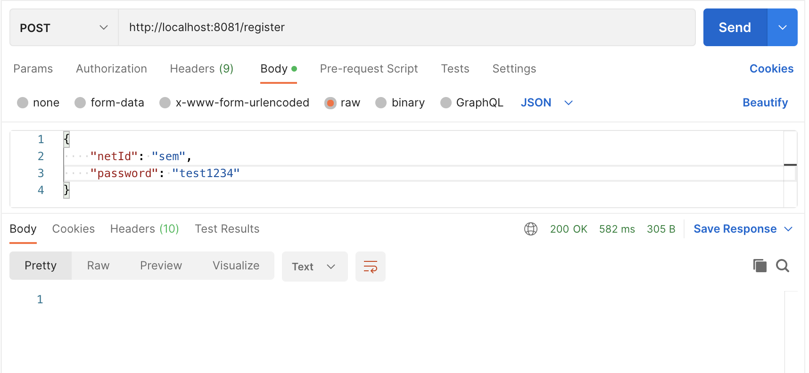
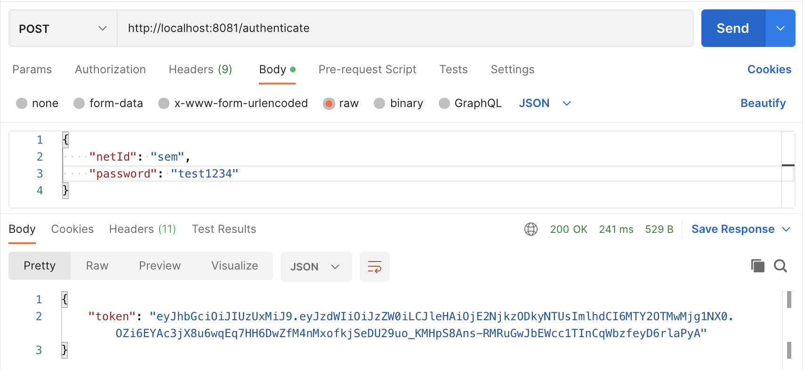
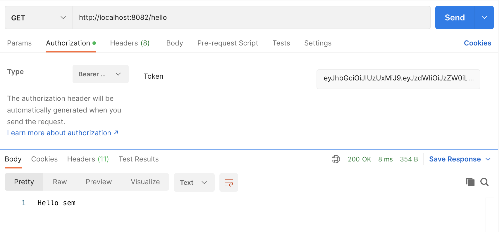
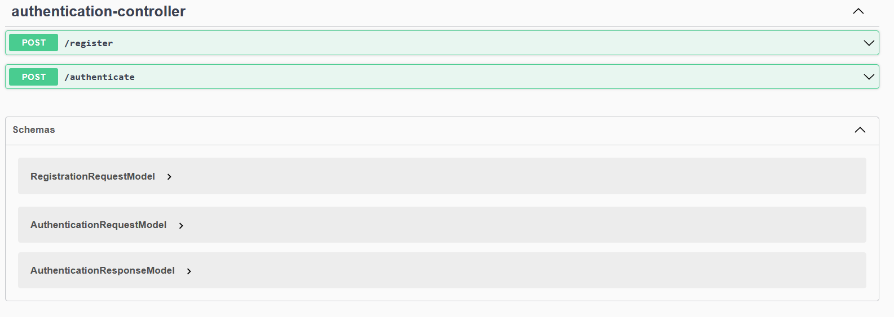

# Lab Template

This template contains two microservices:
- authentication-microservice
- example-microservice

The `authentication-microservice` is responsible for registering new users and authenticating current ones. After successful authentication, this microservice will provide a JWT token which can be used to bypass the security on the `example-microservice`. This token contains the *NetID* of the user that authenticated. If your scenario includes different roles, these will have to be added to the authentication-microservice and to the JWT token. To do this, you will have to:
- Add a concept of roles to the `AppUser`
- Add the roles to the `UserDetails` in `JwtUserDetailsService`
- Add the roles as claims to the JWT token in `JwtTokenGenerator`

The `example-microservice` is just an example and needs to be modified to suit the domain you are modeling based on your scenario.

The `domain` and `application` packages contain the code for the domain layer and application layer. The code for the framework layer is the root package as *Spring* has some limitations on were certain files are located in terms of autowiring.

## Running the microservices

You can run the two microservices individually by starting the Spring applications. Then, you can use *Postman* to perform the different requests:

Register:

Authenticate:

Hello:

# Swagger-UI (OpenAPI)

We have Swagger-UI running on our microservices.

To access the webpage go to: http://localhost:<port>/swagger-ui/index.html
The ports will be different depending on the microservice.
Right now:

8081 - auth
8082 - example-microservice

Example for authentication microservices:

