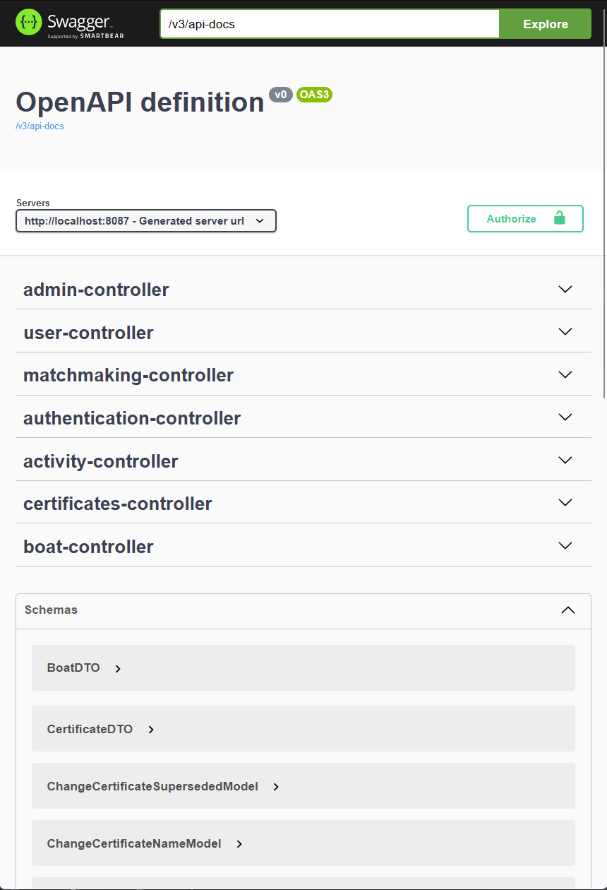
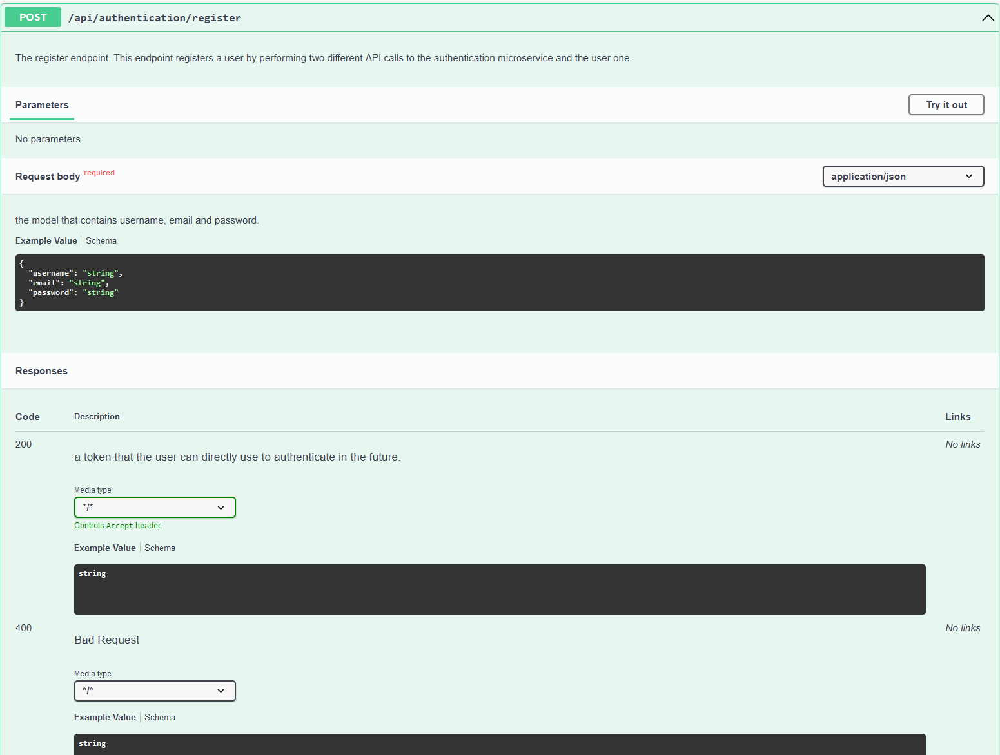
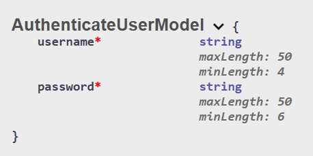
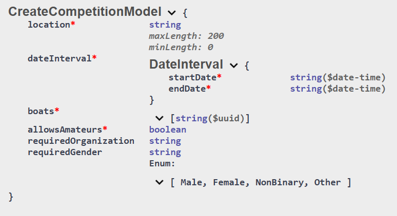

# ROW Project group 33c

This is our project for the Software Engineering Methods course.

We implemented a matching platform for people that want to participate in rowing competition or trainings.

# Structure
This project contains six different microservices:
- `authentication-microservice` - port **8081**
- `activity-microservice` - port **8085**
- `gateway-microservice` - port **8087**
- `matchmaking-microservice` - port **8083**
- `notifications-microservice` - port **8086**
- `users-microservice` - port **8084**

There are also two extra projects which have special uses
- `commons` - handles models and DTOs between different microservices.
- `system-tests` - here we store all of our full end-to-end tests and the functional tests. (Only the test folder is relevant in this project)

### All interactions will be done via the `gateway-microservice`, so the only relevant port for testing and using the application is port number **8087**.

# Running the microservices

In order to run the system you will need to run all six different microservices as spring boot applications.
You can easily do this by running the following command: ```gradle bootRun --parallel```
After making sure all the microservices have started up, all you need to access the interface is go to the following url.

## http://localhost:8087/swagger-ui/index.html

# Important note
In order to create activities you will need to add boat(s) and certitficates to the database.
You can do this only by using the admin endpoints that can be found in the adminController.
In order to use these endpoints you will need to authenticate with the following credentials.
Username: administrator
Password: administrator
The code that adds this user can be found in the authentication-microservice and can be configured to allow a different user to be the administrator.

The administrator should be used only for calling admin endpoints and for nothing else! The admin user does not have an actual user account.

In order to add a boat the database you will first need to create a certificate and reference that in the boat.
After creating a boat you can create an activity after signing out of our administrator account and into a regular user account.

## We provided a step by step tutorial for creating an activity. Please follow the tutorial here: [click here](tutorial.md). It's an md file clearly explaining how to create an activity.
## The file is called "tutorial.md".


# Swagger UI
Here you will be prompted with the following webpage:



This is a way to interact with every endpoint that is accessible.

The endpoints are separated by controller and roughly translate to the different microservices.
In order to use the authenticated endpoints marked with a lock sign make sure to press the green authorize button and provide your token.

In order to get a token you must use the following endpoint that is clearly described in the swagger page:




All endpoints are clearly depicted by their name, javadoc and schema details.

Schemas can be found at the bottom of the page and even include validation remarks of models and DTOs. Failing to take these into consideration will lead to a Constraint Violation Exception Error.

For example this is the authentication model:



And this is the create competition model:



## Functional + Boundary tests

We created a document that can be found in 'docs/Function + Boundary' that presents some of our boundary and functional tests!
Some of the boundary tests can be also be found in some of the microservices with a special folder that says boundary.


## All assignments, agendas and retrospectives can be found under docs/