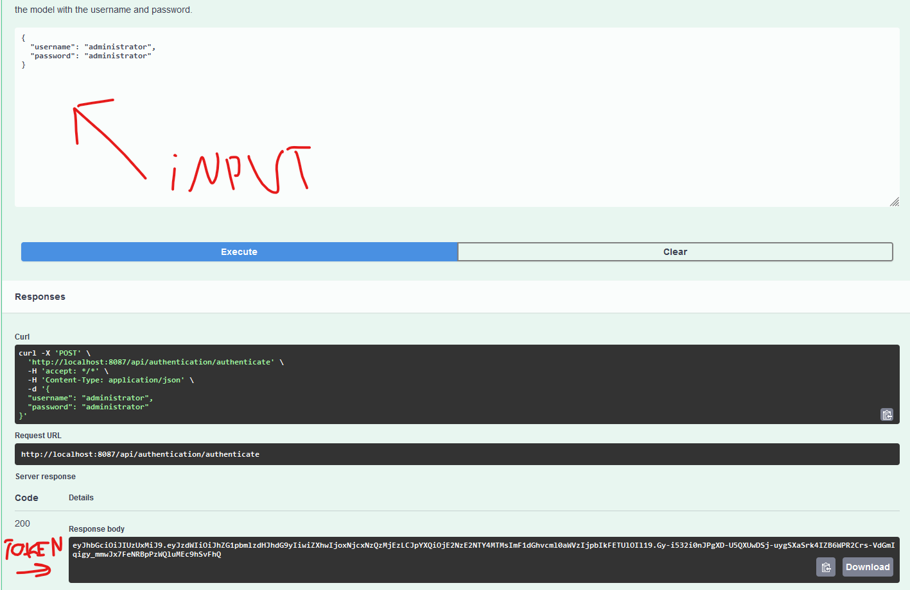
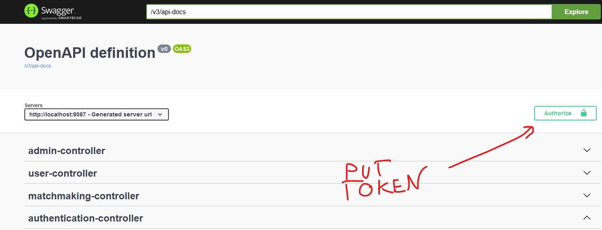
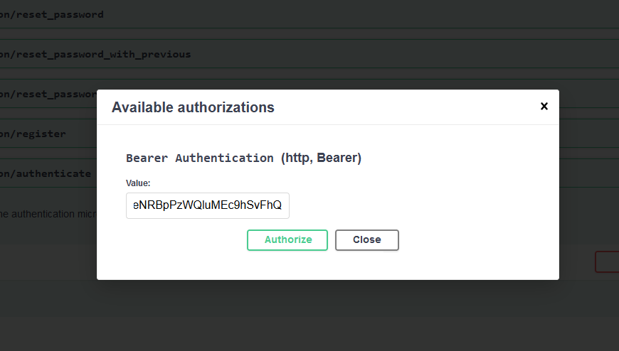
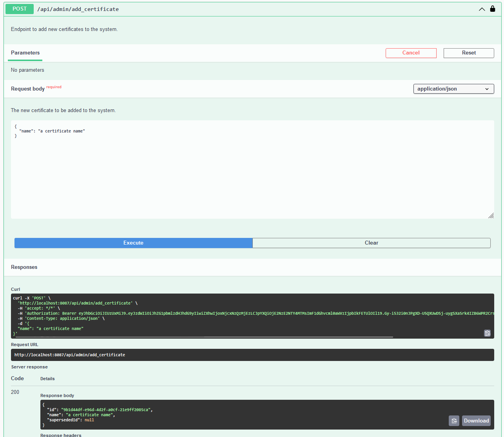
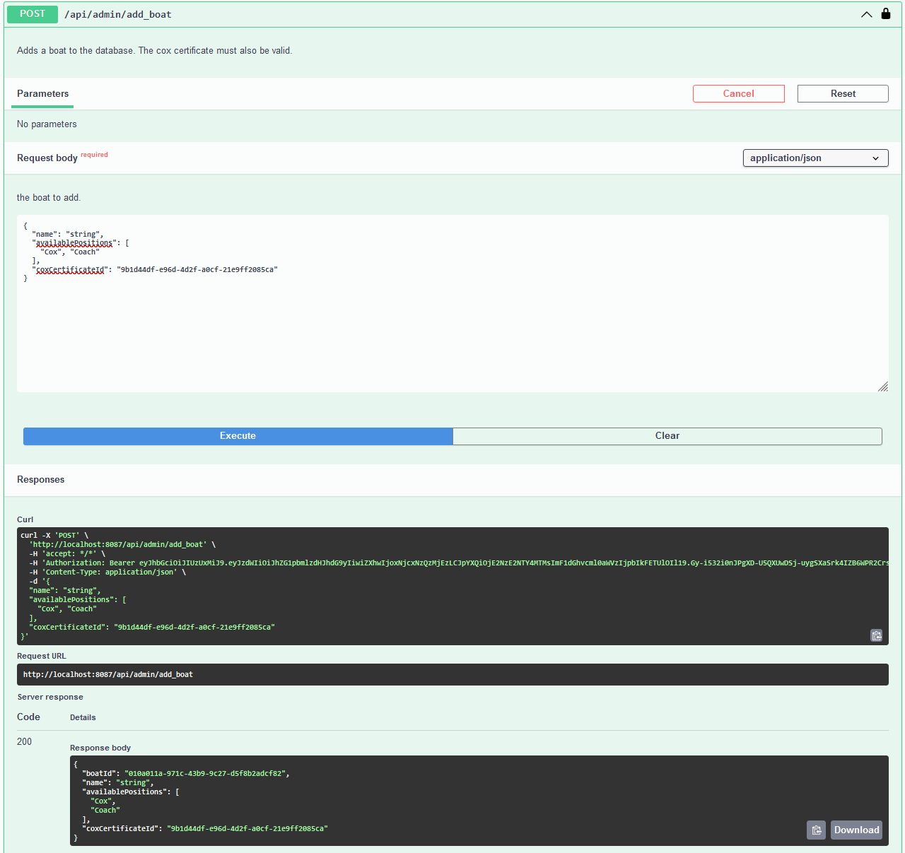
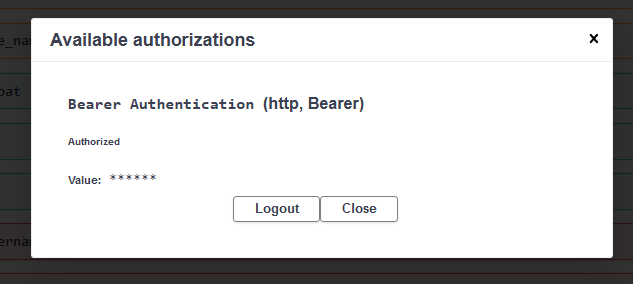
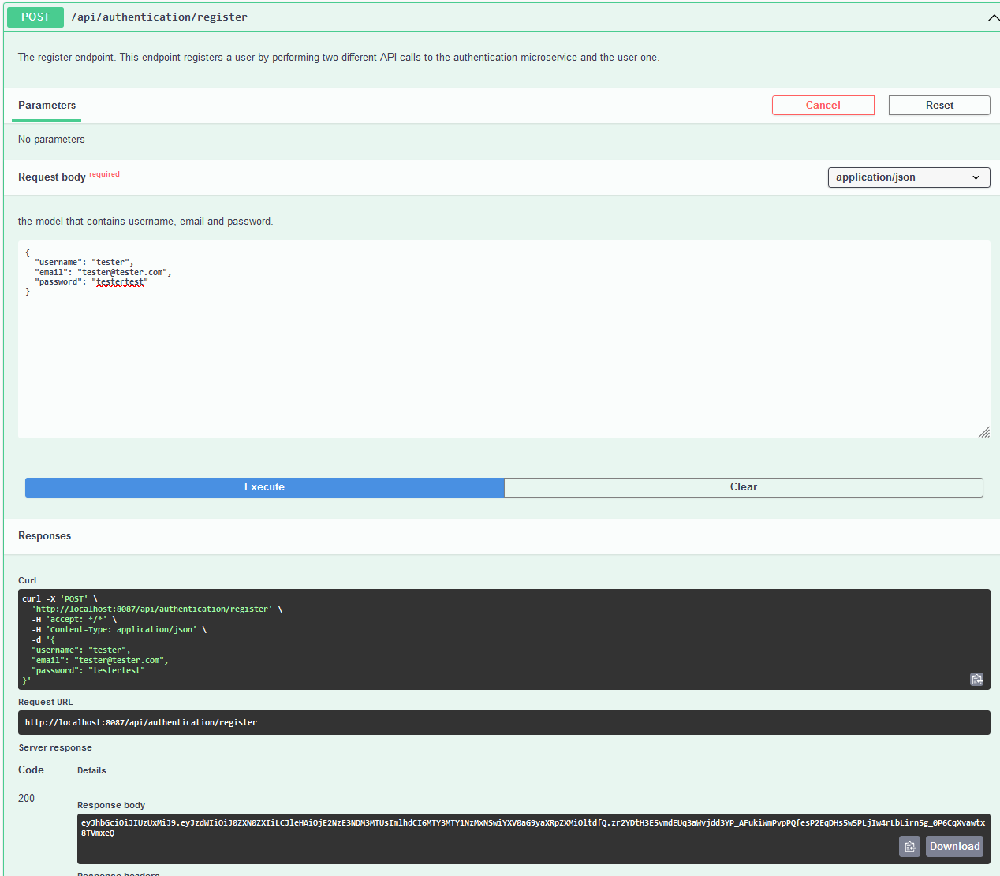
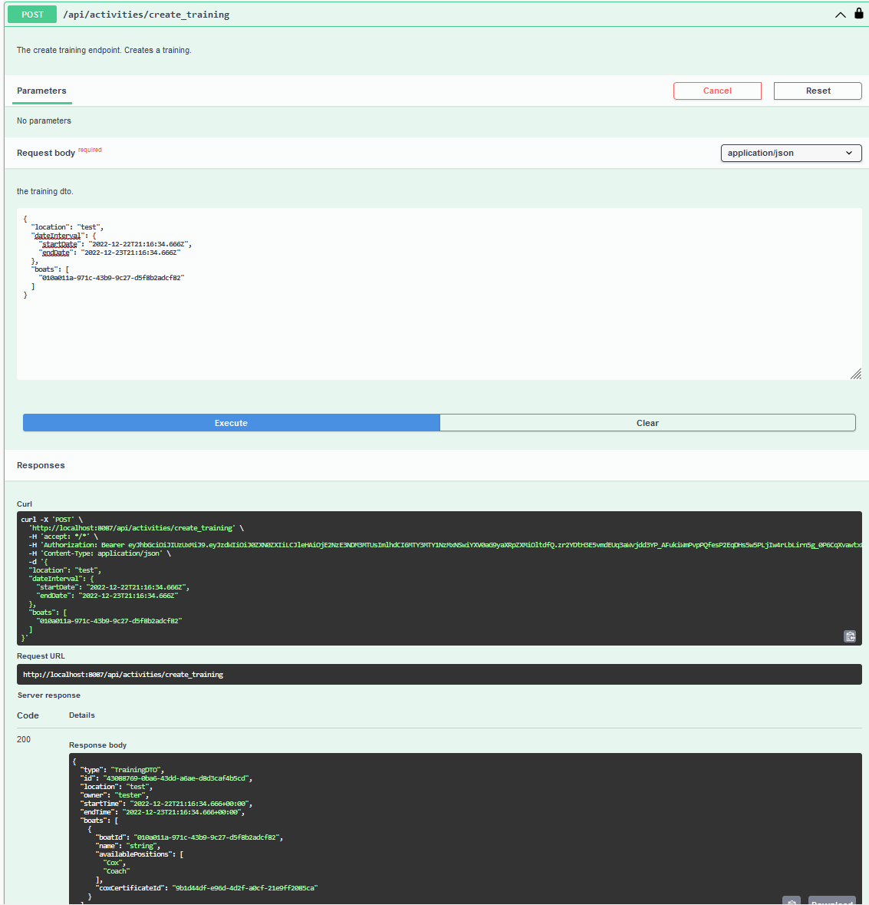

# How to create an activity STEP BY STEP TUTORIAL

In order to create an activity we must first add boats and those require certificates.

This document will provide a tutorial of how to create a training activity from scratch.

## Step 1: We must get ourselves an admin token.
We must first get an admin token.

The admin credentials are administrator and administrator.

The input is just the json of those two elements and the response is a token that we can use to create a boat and the certificate.

Here is where we will be placing the admin token.

After that we can use admin endpoints.

## Step 2: We will now create a certificate

We will call the add certificate endpoint from admin controller.

We will get a response that also includes the id of our certificate.

We can use this id for our next step

## Step 3: Add a boat

We will call the add boat endpoint including our certificate id and we opted for two types of roles in our boat: Coach and Cox but we could also add more if we would like.

We now have the id of our boat.

## Step 4: We will now need to register a normal user

Before registering the new user we will log out of the admin account by going to the same authorize button and clicking log out.

Now that we have logged out we can register a new user.

We have created a new account and gotten a new token. We will place the token where we did previously.

## Step 5: We will now create a new training activity

We need to include our boat in the boats list and selected a date that is in the future.

We received a response model of newly created activity. We can see that it managed to find our boat as it filled in the rest of the details for us automatically.

## We have now managed to create an activity! Now users can easily find it by using the matchmaking controller.